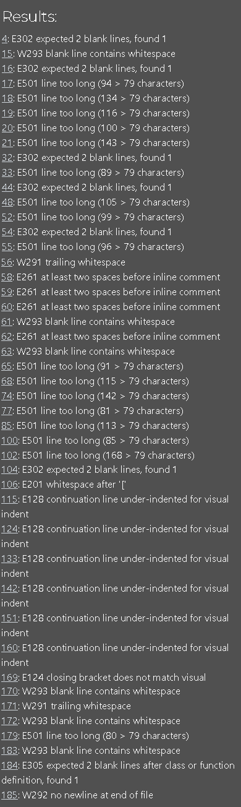

# Hangman

I have developed a hangman game in Python that is played in the terminal. In this game, you compete against the computer, and it offers three difficulty levels: easy, medium, and hard. 

The objective is to guess the hidden word one letter at a time. The computer randomly selects a word, and you guess letters one by one. Correct guesses reveal the letter's position(s) in the word, while incorrect guesses add to the hangman diagram. 

You win by successfully guessing all letters in the word before the hangman diagram is fully drawn, and you lose if you fail to guess the word before the hangman diagram is completed. 

Visit the deployed game [here](https://hangman-terminal-game-84634e4afa2f.herokuapp.com/).

## Table of Contents

1. [User Experience (UX)](#user-experience-ux)
    1. [Project Layout diagram](#project-goals)
    2. [Project Goals](#project-goals)
    3. [Implementation](#Implementation)
    3. [Color Scheme](#color-scheme)
2. [Features](#features)
    1. [Game Start](#game-start)
    2. [Difficulty Screen](#difficulty-screen)
    3. [Instructions Screen](#instructions-screen)
    4. [Start Game Screen](#start-game-screen)
    5. [Correct Guess](#correct-guess)
    6. [Incorrect Guess](#incorrect-guess)
    7. [Winning Message](#winning-message)
    8. [Losing Message](#losing-message)
    9. [Extra Features](#extra-features)
    10. [Technologies Used](#technologies-used)
    11. [Languages Used](#languages-used)
    12. [Libraries and Programs Used](#libraries-and-programs-used)
4. [Testing](#testing)
    1. [Validator errors](#validator-errors)
    2. [Manual Testing](#manual-testing)
5. [Finished Product](#finished-product)
    1. [Game Page](#game-page)
6. [Deployment](#deployment)
    1. [GitHub Pages](#github-pages)
7. [Credits](#credits)
    1. [Content](#content)
8. [Acknowledgements](#acknowledgements)

***

## User Experience (UX)

### Project Layout diagram

### Project Goals

- I want to develop a Hangman game that's effortless to play and straightforward to navigate.
    - Was this achieved?
        - Yes
    - How was this achieved?
        - The game provides clear guidance at every step. Initially, it prompts users to view instructions by typing either Y or N (lowercase is acceptable). Such options are consistently available throughout the game. Users can also select difficulty levels, and all previously chosen letters are visible to them.

- I want to ensure that the user can play the game as many times as they wish.
    - Was this achieved?
        - Yes
    - How was this achieved?
        - Upon completion of the game, the user is presented with the choice to replay by typing either Y or N (lowercase is acceptable).

- I want the user to be able to select from different difficulty levels.
    - Was this achieved?
        - Yes
    - How was this achieved?
        - I've included a separate file(words.py) categorizing words into three groups: easy, medium, and hard. At the beginning of the game, users will be prompted to choose from these options by typing either "easy," "medium," or "hard," and the game will select words accordingly from the relevant list.

- I want the user to have access to all pertinent information during gameplay, including their guesses, remaining attempts, and the Hangman image.
    - Was this achieved?
        - Yes
    - How was this achieved?
        - Once the game commences, the Hangman image will be displayed. As the user starts and selects a letter, if it's correct, they'll be notified and the letter will be added to a list of guessed letters. In case of an incorrect choice, the user will be informed, and the letter will be added to the guessed letters section. Additionally, the Hangman's parts will begin to be added.

### Implementation

- At the outset of this project, I started by outlining the basic design depicted in the Project Layout Diagram. This layout served as the blueprint for the final game upon completion. Initially, I sought guidance from various YouTube videos and step-by-step guides to construct the fundamental game without incorporating difficulty levels or comprehensive instructions. After establishing this foundation, I proceeded to expand upon it, gradually refining the game to align with the initial project design.

### Color Scheme

- I have created a class of colours to choose from and I have added to the code where required. I have referenced [ANSI escape code](https://en.wikipedia.org/wiki/ANSI_escape_code) to get the relevant codes and I have used this as reference throughout. 

- In the initial sections, Cyan and Blue hues were employed for introductory and instructional messages, as well as for indicating difficulty levels. Green was chosen to convey correctness or positive outcomes, while red was reserved for signaling incorrect guesses or negative feedback.

## Features

### Game Start

* This screen greets the user at the start of the game and offers the option to view the instructions.

### Difficulty Screen

* This screen appears after the user has read the instructions or declined to view them.

### Instructions Screen

* At the start of the game, this screen welcomes the user and provides the option to view the instructions.

### Start Game Screen

* This is the screen displayed when the user starts the game.

### Correct guess

* This is what appears when the user selects a correct answer.

### Incorrect guess

* This is what appears when the user selects an incorrect answer.

### Winning message

* This is what appears when the user wins the game.

### Losing message

* This is what appears when the user loses the game.

## Extra Features

Following the completion of the fundamental game structure, I expanded its functionality by introducing three difficulty levels through the creation of corresponding lists in words.py. Additionally, I integrated hangman stages that dynamically adjust based on the user's guesses. To enhance the user experience, I incorporated code to clear the terminal at strategic points throughout the game.

## Technologies Used

### Languages Used

* Python(https://en.wikipedia.org/wiki/Python_(programming_language))

### Libraries and Programs Used

* [GitPod](https://gitpod.io/)
    - GitPod was used for writing code, committing, and then pushing to GitHub.

* [GitHub](https://github.com/)
    - GitHub was used to store the project after pushing.

* [Am I Responsive?](http://ami.responsivedesign.is/#)
    - Am I Responsive was used to for the beggining image at the beggining of this README

* [CI Python Linter](https://pep8ci.herokuapp.com/#)
    - CI Python Linter was used to validate the Python code.

[Back to top ⇧](#table-of-contents)

## Testing

### Validator errors

### Python

- I have used [CI Python Linter](https://pep8ci.herokuapp.com/)

- I was given the following errors

- E302 expected 2 blank lines, found 1
    - To fix this I added another line, giving it the required 2 blank lines

- W293 blank line contacts whitespace
    - Removed white space through the code

- E501 line too long (91 > 79 characters)
    - As you can see from the above images there was quite a few over, I adjusted all code onto new lines where required.

- W292 no newline at end of file
    - Added new line at the end of the file

- E128 continuation line under-indented for visual indent
    - fixed indentation issue on linter and then adjusted on the run.py file

### Manual Testing

* Game Testing

    Feature | Outcome | Example | Pass/Fail
    --- | --- | --- | ---
    Welcome message | When the game loads - Welcome message appears  and message asking user if they want to read instructions |  | Pass - Game screen loads as expected
    Optional instructions | Give user the option to see instructions by pressing either Y or N - pressing Y shows the user the instructions|  | Pass - User sees instructions
    Optional instructions | Give user the option to see instructions by pressing either Y or N - pressing N takes the user to the difficulty selection screen |  | Pass - User is taken to next screen, bypassing instructions.
    User selects letter, fills in guessed letters | User enters letter - guessed letter is added to guessed letters list |   | Pass - Letter added
    Confirmation message of correct letter | Message appears confirming the correct user guess |  | Pass - Message appears
    Confirmation message of incorrect letter | Message appears confirming the incorrect user guess |  | Pass - Message appears
    Already guessed | user selects a letter already chosen - error message appears |   | Pass - Message appears
    User enters full word | User attempts to guess the word - relevant message appears if correct or incorrect |    | Pass - Message appears
    Invalid entry | User enters incorrect character - correct error message appears |  | Pass - Message appears
    Empty data entry | User clicks enter or space and enter - message appears telling user of invalid entry |  | Pass - Message appears

[Back to top ⇧](#table-of-contents)

## Finished Product

### Game Page

* Landing Page

* Instructions Page

* Difficulty Page

* Game Start Page

* Correct Guess

* Incorrect Guess

* Game Won

* Game Lost

* Play Again(No)

## Deployment

Deploying this project to Heroku involved several steps:

1. If I installed any packages in Gitpod, I would need to add them to a requirements list.

    - To accomplish this, I'd type pip3 freeze > requirements.txt and press enter. This action updates the requirements.txt file.
    - Then, I would commit and push this to GitHub.
    - Heroku utilizes this list to install the dependencies into the application prior to running the project.
    - However, I didn't require any packages.
    - I navigated to my Heroku dashboard and selected 'create a new app'.

2. I selected a name for my app; each app must have a unique name. Since 'hangman' was already taken, I opted for 'hangman-terminal-game'.

3. I chose my region and clicked 'create app'.

4. Next, I accessed the 'settings' tab located at the top of the page.

6. Some apps contain sensitive data within the Gitpod workspace, which isn't present in the GitHub repository due to being intentionally protected in the .gitignore file. Although I had no data to protect, the following steps would typically be followed.

    - To do this, I would click 'reveal config vars'.
    - Fill in the key, for example: CREDS.
    - Then, I would copy and paste the contents of the 'CREDS' file into the value field and click 'add'.

7. I included the required buildpacks by selecting the buildpack button.

    - I selected 'python' and pressed 'save changes'.
    - Then, I repeated the process, selecting 'nodejs' this time.
    - I ensured it was done in that order, with 'python' at the top and 'nodejs' below.

8. I scrolled back up to the tab at the top and clicked 'deploy'.

9. I selected 'GitHub' as the deployment method and clicked 'connect to GitHub'.

10. After selecting this, I searched for my GitHub repository name and connected to the correct repository.

11. Then, I scrolled down, where there were two options:

    - The first option is to enable automatic deployment, meaning Heroku will rebuild the app every time I push a change to GitHub.
    - The second option is to manually deploy, which I chose for this project at the beggining and after used automatic deploys.

12. Once all the code is received from GitHub, there is a 'view' button that links to the running app. I clicked this to ensure everything was running as expected.

Go back to [Table of contents](#table-of-contents)

## Credits 

* [Canva](https://www.canva.com/) - I used this to create the chart

* [CI Python Linter](https://pep8ci.herokuapp.com/#) - I used this to check for errors

* [ChatGPT](https://chatgpt.com/?oai-dm=1) - I used this to create the three groups of lists

### Content

- Throughout the development process of this game, I extensively utilized walkthrough videos as valuable resources. These videos, sourced from various creators, provided invaluable insights and guidance, enabling me to grasp essential concepts and tackle challenges effectively. Specifically, I frequently referred to tutorials hosted by [Kite](https://www.youtube.com/@KiteHQ) on their YouTube channel. Their detailed explanations and demonstrations significantly contributed to my understanding and proficiency in game development. I proceeded to enhance the program by incorporating additional features such as a difficulty selection option and displaying the guessed letters.

[Back to top ⇧](#table-of-contents)

## Acknowledgements

- Marcel provided invaluable guidance throughout the process, helping me maintain focus and steering me in the right direction.
- I'd also like to express my gratitude to my partner, who has shown remarkable patience as I've studied and worked on this project.

[Back to top ⇧](#table-of-contents)
