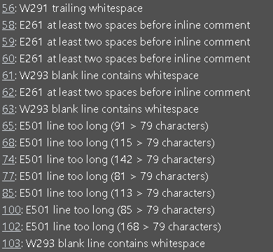

# Hangman

I have developed a hangman game in Python that is played in the terminal. In this game, you compete against the computer, and it offers three difficulty levels: easy, medium, and hard. 

The objective is to guess the hidden word one letter at a time. The computer randomly selects a word, and you guess letters one by one. Correct guesses reveal the letter's position(s) in the word, while incorrect guesses add to the hangman diagram. 

You win by successfully guessing all letters in the word before the hangman diagram is fully drawn, and you lose if you fail to guess the word before the hangman diagram is completed. 

Visit the deployed game [here](https://hangman-terminal-game-84634e4afa2f.herokuapp.com/).

## Table of Contents

1. [User Experience (UX)](#user-experience-ux)
    1. [Project Layout diagram](#project-goals)
    2. [Project Goals](#project-goals)
    3. [Implementation](#implentation)
    3. [Color Scheme](#color-scheme)
2. [Features](#features)
    1. [General](#general)
    2. [Welcome Message](#welcome)
    3. [Technologies Used](#technologies-used)
    1. [Languages Used](#languages-used)
    2. [Libraries and Programs Used](#libraries-and-programs-used)
4. [Testing](#testing)
    1. [Code Validation](#code-validation)
    2. [Tools Testing](#tools-testing)
    3. [Manual Testing](#manual-testing)
5. [Finished Product](#finished-product)
6. [Deployment](#deployment)
    1. [GitHub Pages](#github-pages)
7. [Credits](#credits)
    1. [Content](#content)
    3. [Code](#code)
8. [Acknowledgements](#acknowledgements)

***

## User Experience (UX)

### Project Layout diagram

### Project Goals

- I want to develop a Hangman game that's effortless to play and straightforward to navigate.
    - Was this achieved?
        - Yes
    - How was this achieved?
        - The game provides clear guidance at every step. Initially, it prompts users to view instructions by typing either Y or N (lowercase is acceptable). Such options are consistently available throughout the game. Users can also select difficulty levels, and all previously chosen letters are visible to them.

- I want to ensure that the user can play the game as many times as they wish.
    - Was this achieved?
        - Yes
    - How was this achieved?
        - Upon completion of the game, the user is presented with the choice to replay by typing either Y or N (lowercase is acceptable).

- I want the user to be able to select from different difficulty levels.
    - Was this achieved?
        - Yes
    - How was this achieved?
        - I've included a separate file(words.py) categorizing words into three groups: easy, medium, and hard. At the beginning of the game, users will be prompted to choose from these options by typing either "easy," "medium," or "hard," and the game will select words accordingly from the relevant list.

- I want the user to have access to all pertinent information during gameplay, including their guesses, remaining attempts, and the Hangman image.
    - Was this achieved?
        - Yes
    - How was this achieved?
        - Once the game commences, the Hangman image will be displayed. As the user starts and selects a letter, if it's correct, they'll be notified and the letter will be added to a list of guessed letters. In case of an incorrect choice, the user will be informed, and the letter will be added to the guessed letters section. Additionally, the Hangman's parts will begin to be added.

### Implementation

- At the outset of this project, I started by outlining the basic design depicted in the Project Layout Diagram. This layout served as the blueprint for the final game upon completion. Initially, I sought guidance from various YouTube videos and step-by-step guides to construct the fundamental game without incorporating difficulty levels or comprehensive instructions. After establishing this foundation, I proceeded to expand upon it, gradually refining the game to align with the initial project design.

### Color Scheme

- I have created a class of colours to choose from and I have added to the code where required. I have referenced [ANSI escape code](https://en.wikipedia.org/wiki/ANSI_escape_code) to get the relevant codes and I have used this as reference throughout. 

- In the initial sections, Cyan and Blue hues were employed for introductory and instructional messages, as well as for indicating difficulty levels. Green was chosen to convey correctness or positive outcomes, while red was reserved for signaling incorrect guesses or negative feedback.

## Features

### Game Start

* This screen appears at the beggining of the game, welcoming the user and giving the option to see the instructions.

### Difficulty Screen

* This screen appears after the user as read the instructions or if they decline the instructions it will also take them here.

### instructions Screen

* This screen appears at the beggining of the game, welcoming the user and giving the option to see the instructions.

### Start Game Screen

* THis is the screen shown when the user starts the game.

### Correct guess

* This is what is displayed when the user selects a correct answer

### Incorrect guess

* This is what is displayed when the user selects a incorrect answer.

### Winning message

* This is what is displayed when the user wins the game

### Losing message

* This is what is displayed when the user wins the game

## Extra Features

Once I had completed the basic game structure which was working I have then added in 3 difficultly levels, creating 3 new lists in words.py. I have also added in the stages of the hangman which changes based on user guess.

## Technologies Used

### Languages Used

* Python(https://en.wikipedia.org/wiki/Python_(programming_language))

### Libraries and Programs Used

* [GitPod](https://gitpod.io/)
    - GitPod was used for writing code, committing, and then pushing to GitHub.

* [GitHub](https://github.com/)
    - GitHub was used to store the project after pushing.

* [Am I Responsive?](http://ami.responsivedesign.is/#)
    - Am I Responsive was used to for the beggining image at the beggining of this README

* [CI Python Linter](https://pep8ci.herokuapp.com/#)
    - CI Python Linter was used to validate the Python code.

[Back to top ⇧](#table-of-contents)

## Testing

### Validator errors

### Python

- I have used CI Python Linter[Python Linter](https://pep8ci.herokuapp.com/)

- I was given the following errors

- On the list of errors there was Line too long and issues with white space. 

- To fix there errors I have readjusted the code/comments to fall within the parameters of 79 characters.

- The process I followed was to fix one issue at a time on the linter to ensure the error was fixed and then made the change on the code itself. 

- Once complete I re ran the test to ensure it passed. 

### Manual Testing

* Common Elements Testing

    - General

    Feature | Outcome | Example | Pass/Fail
    --- | --- | --- | ---
    Welcome message | When the game loads - Welcome message appears  and message asking user if they want to read instructions |  | Pass - Game screen loads as expected
    Optional instructions | Give user the option to see instructions by pressing either Y or N - pressing Y shows the user the instructions|  | Pass - User sees instructions
    Optional instructions | Give user the option to see instructions by pressing either Y or N - pressing N takes the user to the difficulty selection screen |  | Pass - User is taken to next screen, bypassing instructions.
    User selects letter, fills in guessed letters | User enters letter - guessed letter is added to guessed letters list |   | Pass - Letter added
    Confirmation message of correct letter | Message appears confirming the correct user guess |  | Pass - Message appears
    Confirmation message of incorrect letter | Message appears confirming the incorrect user guess |  | Pass - Message appears
    Already guessed | user selects a letter already chosen - error message appears |   | Pass - Message appears
    User enters full word | User attempts to guess the word - relevant message appears if correct or incorrect |    | Pass - Message appears
    Invalid entry | User enters incorrect character - correct error message appears |  | Pass - Message appears
    Empty data entry | User clicks enter or space and enter - message appears telling user of invalid entry |  | Pass - Message appears

[Back to top ⇧](#table-of-contents)

## Finished Product

### Game Page

* Landing Page

* Instructions Page

* Difficulty Page

* Game Start Page

* Correct Guess

* Incorrect Guess

* Game Won

* Game Lost

* Play Again(No)

## Deployment

There were many steps to deploying this project to Heroku:

1. If I had installed any packages in Gitpod, I would need to add them to a list of requirements.

    - To do this, I would type pip3 freeze > requirements.txt and hit enter. This updates the requirements.txt file.
    - Then, I would commit and push this to GitHub.
    - Heroku uses this list to install the dependencies into the application before running the project.
    - However, I didn't require any packages.
    - I went to my Heroku dashboard and clicked on 'create a new app'.

2. I chose a name for my app; each app must have a unique name. Since 'hangman' was already taken, I went with 'hangman-terminal-game'.

3. I selected my region and clicked 'create app'.

4. I then navigated to the 'settings' tab at the top of the page.

6. Some apps include sensitive data in the Gitpod workspace that isn't in the GitHub repository because it has been deliberately protected in the .gitignore file. I had no data to protect but the below steps would be followed.

    - To do this, I would click 'reveal config vars'.
    - Fill in the key, for example: CREDS.
    - Then, I would copy and paste the contents of the 'CREDS' file into the value field and click 'add'.

7. I added the necessary buildpacks by clicking on the buildpack button.

    - I selected 'python' and pressed 'save changes'.
    - Then, I repeated the process, selecting 'nodejs' this time.
    - I ensured it was done in that order, with 'python' at the top and 'nodejs' below.

8. I scrolled back up to the tab at the top and clicked 'deploy'.

9. I selected 'GitHub' as the deployment method and clicked 'connect to GitHub'.

10. After selecting this, I searched for my GitHub repository name and connected to the correct repository.

11. Then, I scrolled down, where there were two options:

    - The first option is to enable automatic deployment, meaning Heroku will rebuild the app every time I push a change to GitHub.
    - The second option is to manually deploy, which I chose for this project at the beggining and after used automatic deploys.

12. Once all the code is received from GitHub, there is a 'view' button that links to the running app. I clicked this to ensure everything was running as expected.

Go back to [Table of contents](#table-of-contents)

## Credits 

* 

### Content

- 
   

### Code

- 

[Back to top ⇧](#table-of-contents)

## Acknowledgements

- 

[Back to top ⇧](#table-of-contents)
